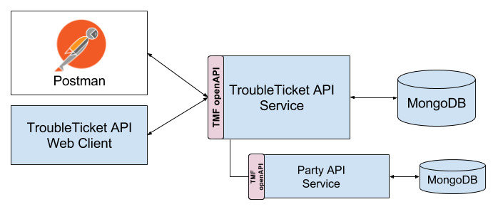

## Implementation of the TM Forum Trouble Ticket Management API

**TM Forum [API Overview](https://projects.tmforum.org/wiki/display/API/Open+API+Table)**

### Overview

### Getting started

- Clone this repository locally
- Install required modules: 'npm install'
- Start mongodb: 'npm run mongo-init' (inital start-up) or 'npm run mongo-up' (start server)
- Start REST API: 'swagger project start'

#### Client UI (locally) ####
- 'cd client'
- 'npm run dev'
